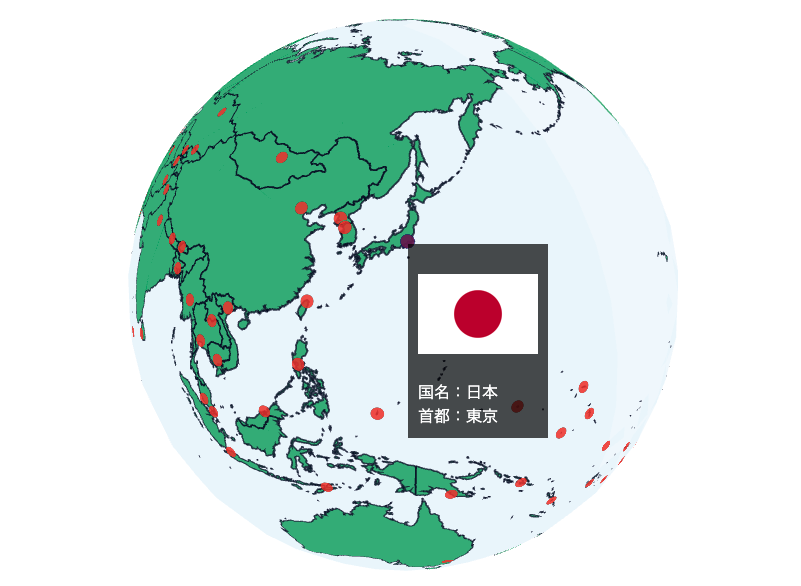

## 世界の首都・国旗

世界の首都・国旗の情報を、デジタル地球儀にまとめました。地理教育などにご利用ください！

## 使用したデータ

世界の首都の位置データ(https://amano-tec.com/data/world.html)

世界の国旗（https://amano-tec.com/data/worldflags.html)

世界の首都の位置データは、2022年6月1日現在のものです。

世界の国旗のデータは、2015年6月1日現在のものです。（ただし、モーリタニアは2017年に国旗が変わっているので、データを修正しました。）

## ライセンス

CC BY 4.0（https://creativecommons.org/licenses/by/4.0/deed.ja）
